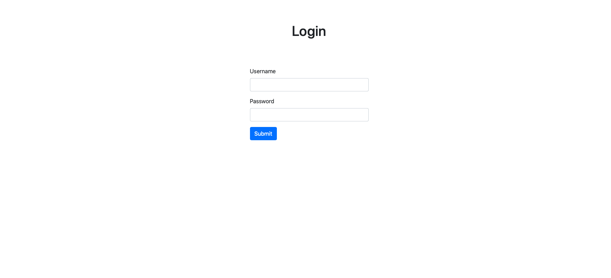
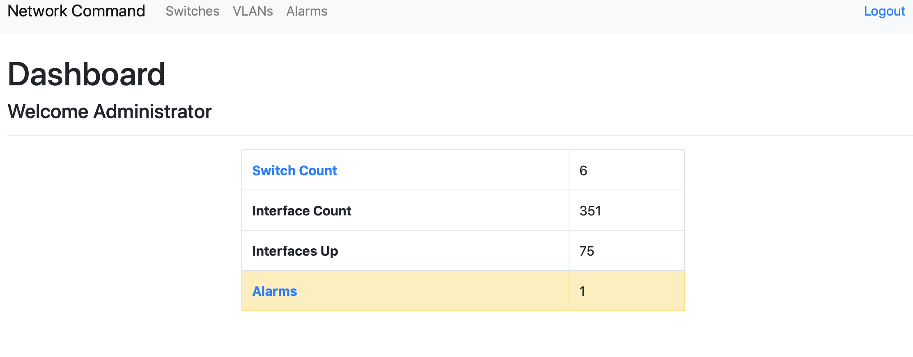
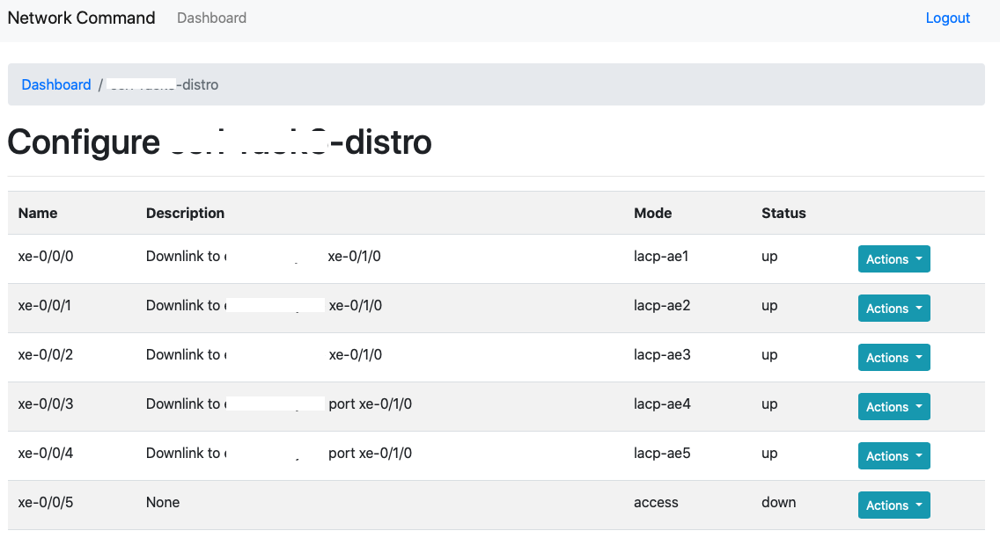
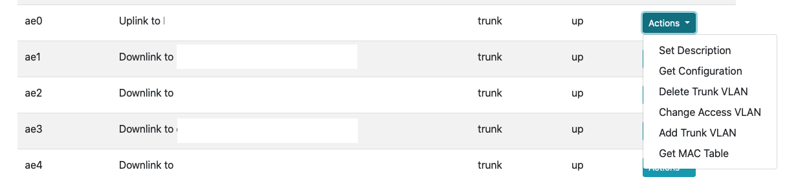

# Network Command
This project is a Flask based SDN controller for Juniper EX series switches.


### Background
This controller was built as a final project for Marist College MSIS603 - Network Virtualization, Spring 2020.

This controller is built on Python using Flask and Bootstrap as a frontend and Juniper's PyEZ as the backend connections to switches.

***NOTE***: This app is not secure. It requires a file called `users.json` and `switch.json` so all the info in it is in plaintext. A full implementation of this should use a secure database, not plain text files.

## Screenshots





## Install
Before using this controller, you must have `Python3` installed along with `Python Pip`.<br>
Clone the repo and change into the directory.
```bash
pip install -R requirements.txt
```
Then create the `switches.json`, `users.json`, and `config.json` files.
```bash
cp JSON\ Examples/switches.json-example switches.json
cp JSON\ Examples/users.json-example users.json
cp JSON\ Examples/config.json-example config.json
```
Edit the `config.json` file to your needs.
```json
{
    "username":"myUsername",
    "password":"Plaintext_Password",
    "sessionKey":"abcdef1234567890"
}
```
The `username` and `password` keys are for the credentials of your Juniper switches. Ideally, you have a user named `pyez` or `netconf`. The `sessionKey` is just the encryption key for Flask's session files, this can be a string of any values you'd want.<br>
<br>
Then edit the `users.json` file. By default, the username is `admin` and password is `admin` to create more users, edit the JSON file using the admin user as an example. The password is a MD5 hash. To generate this hash run the following, subsituting the desired password for $PASSWORD.
```bash
echo -n '$PASSWORD' | md5sum
```

Once the users file created, you can add switches in the `switches.json` file. Again, use the example file to add new switches.
```json
{
        "switches":[{
                "name":"mydatacenter-distro",
                "ipAddress": "100.64.10.20",
                "location":{
                        "datacenter":"basement",
                        "rack":"12",
                        "u":"5"
                        }
                }
        ]       
}
```


## Usage
### Python
This app can be ran straight from Python.


